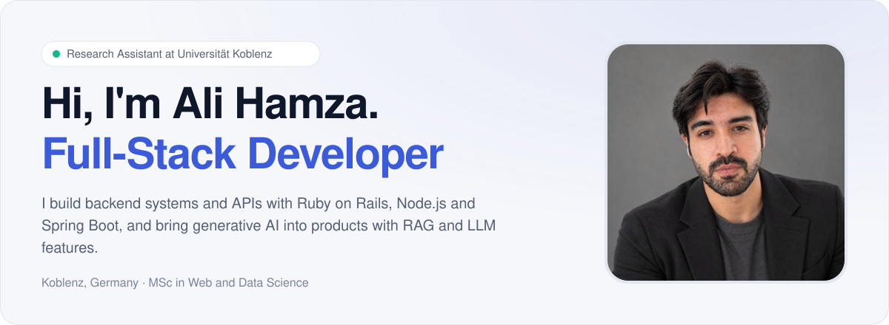
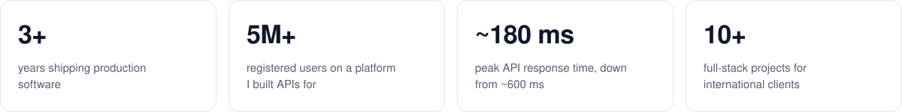
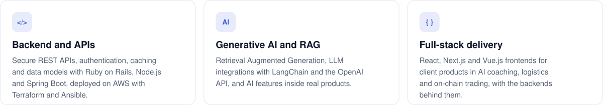
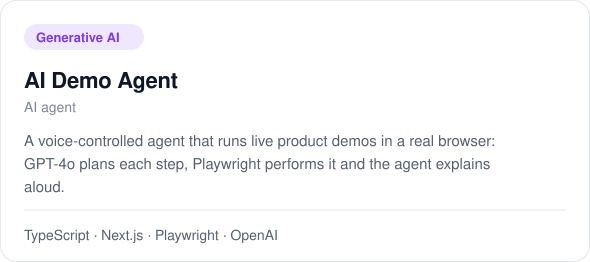
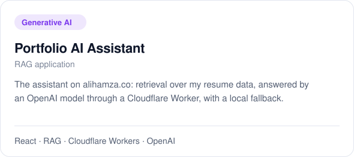
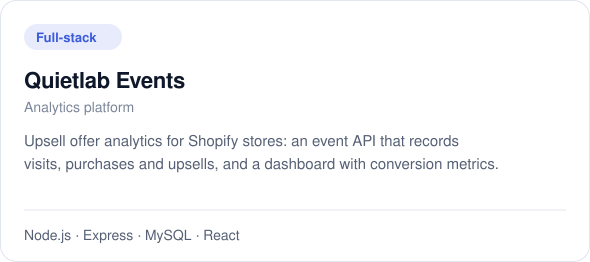
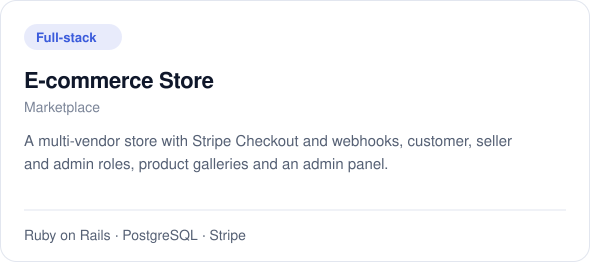
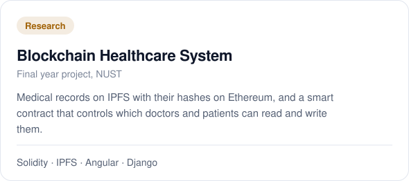
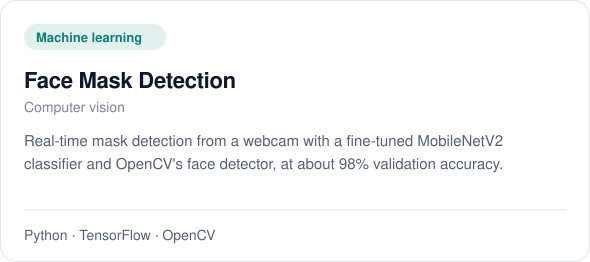

<a href="https://www.alihamza.co">
  <picture>
    <source media="(prefers-color-scheme: dark)" srcset="assets/banner-dark.svg">
    
  </picture>
</a>

  
  
  

<picture>
  <source media="(prefers-color-scheme: dark)" srcset="assets/stats-dark.svg">
  
</picture>

### What I do

<picture>
  <source media="(prefers-color-scheme: dark)" srcset="assets/focus-dark.svg">
  
</picture>

### Selected projects

  <a href="https://github.com/itzalihamza7/AI-demo-Agent"><picture><source media="(prefers-color-scheme: dark)" srcset="assets/project-ai-demo-agent-dark.svg"></picture></a>
  <a href="https://github.com/itzalihamza7/Portfolio"><picture><source media="(prefers-color-scheme: dark)" srcset="assets/project-portfolio-assistant-dark.svg"></picture></a>
  <a href="https://github.com/itzalihamza7/QuietlabEvents"><picture><source media="(prefers-color-scheme: dark)" srcset="assets/project-quietlab-events-dark.svg"></picture></a>
  <a href="https://github.com/itzalihamza7/Ecommerece"><picture><source media="(prefers-color-scheme: dark)" srcset="assets/project-ecommerce-store-dark.svg"></picture></a>
  <a href="https://github.com/itzalihamza7/Al-Tabeeb"><picture><source media="(prefers-color-scheme: dark)" srcset="assets/project-blockchain-health-dark.svg"></picture></a>
  <a href="https://github.com/itzalihamza7/Face-mask-detection"><picture><source media="(prefers-color-scheme: dark)" srcset="assets/project-face-mask-dark.svg"></picture></a>

### Professional work

- **[Al-Tabeeb](https://tabibgroup.net/)** at Veroke: Tabib Group's healthcare platform in Saudi Arabia. Ruby on Rails backend and REST API, with a Node.js messaging service
- **Iwish** at Veroke: a peer-to-peer marketplace app where travellers fulfil wishes for items from abroad. I built its Node.js APIs
- **Client products** through Upwork: [10XCoach](https://10xcoach.ai/) (AI business coaching), [Nexmuv](https://nexmuv.com/) (moving and logistics), [Friendsy](https://friendsy.life/) (AI voice agents) and [Chainbox](https://chainbox.ai/) (on-chain trading)
- **Research Assistant** at Universität Koblenz: Spring Boot services and Vue.js visualizations that connect ERP data into a knowledge graph

### Tech stack

<picture>
  <source media="(prefers-color-scheme: dark)" srcset="https://skillicons.dev/icons?i=rails,ruby,nodejs,express,spring,java,py,ts,react,nextjs,vue,tailwind&theme=dark">
  
</picture>
 
<picture>
  <source media="(prefers-color-scheme: dark)" srcset="https://skillicons.dev/icons?i=postgres,mysql,mongodb,redis,aws,docker,terraform,ansible,tensorflow,pytorch,sklearn,git&theme=dark">
  
</picture>

Plus the OpenAI API, LangChain and RAG for generative AI features.

### Certificates

  
  
  

<a href="https://www.alihamza.co">
  <picture>
    <source media="(prefers-color-scheme: dark)" srcset="assets/cta-dark.svg">
    
  </picture>
</a>
